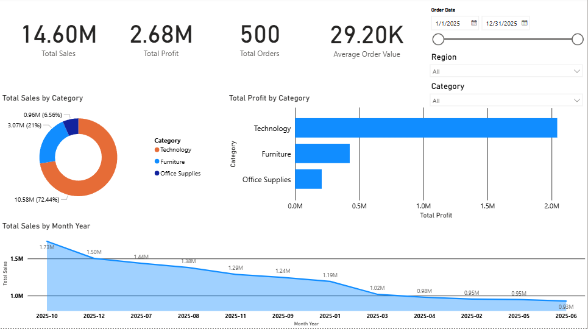
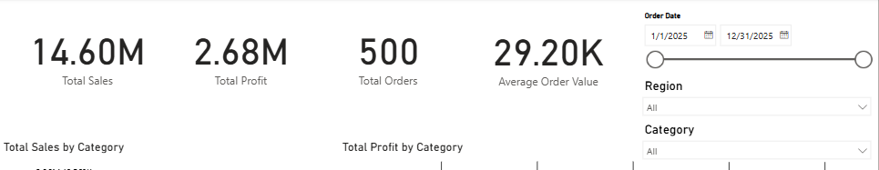
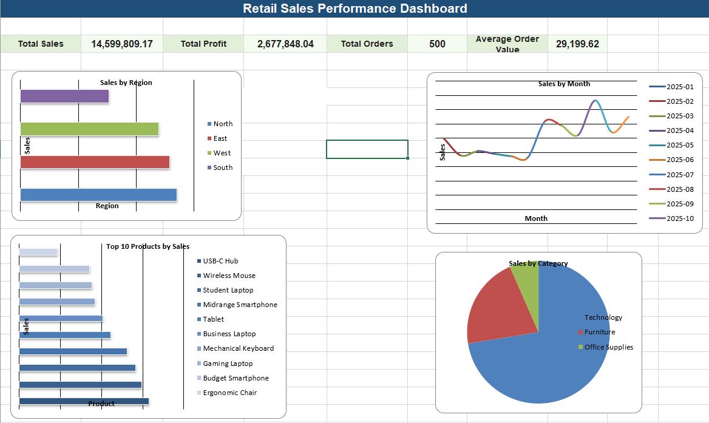
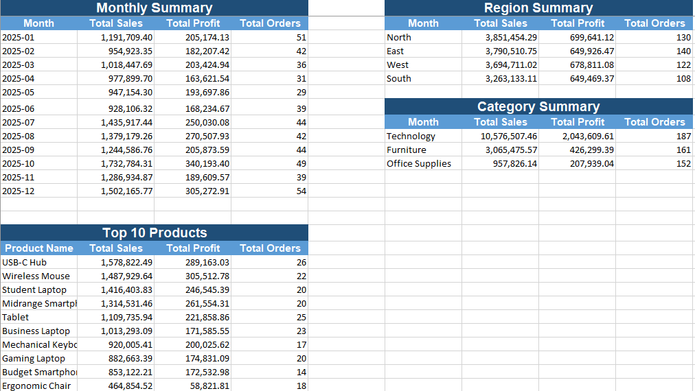

# Sales Dashboard Analysis

A sales analytics portfolio project built using **Excel** and **Power BI** to analyze revenue, profit, category trends, monthly sales performance, and structured transaction data.

## Overview
This project demonstrates how transactional sales data can be transformed into an interactive dashboard for business reporting and decision-making.  
It includes both an **Excel dashboard version** and a **Power BI dashboard version**.

## Tools Used
- Power BI
- Microsoft Excel
- CSV dataset
- Basic data cleaning
- DAX measures
- Dashboard design

## Key KPIs
- Total Sales
- Total Profit
- Total Orders
- Average Order Value

## Dashboard Features
### Power BI
- KPI cards
- Date range filter
- Region slicer
- Category slicer
- Sales by month
- Sales by category
- Profit by category

### Excel
- KPI summary
- Sales by region
- Sales by month
- Sales by category
- Top 10 products by sales
- Summary tables for month, region, and category

## Project Files
- `files/Sales_Dashboard_Analysis.pbix` – Power BI dashboard
- `files/Sales_Dashboard_Analysis_Starter.xlsx` – Excel dashboard
- `data/sales_dashboard_sample_data.csv` – source dataset

## Screenshots

### Power BI Dashboard

### Power BI KPIs and Filters

### Excel Dashboard

### Excel Summary Tables

## Key Insights
- Technology generated the highest share of sales and profit in the dataset.
- Monthly sales performance varied across the year, showing stronger revenue in later months.
- Office Supplies contributed the smallest share of total revenue compared with the other categories.

## Why This Project Matters
This project shows practical skills in:
- dashboard development
- KPI reporting
- business data analysis
- visual storytelling
- Excel and Power BI presentation

## Resume Description
Built an interactive sales dashboard using Excel and Power BI to analyze revenue, profit, category trends, and monthly sales performance for reporting and decision-making.
